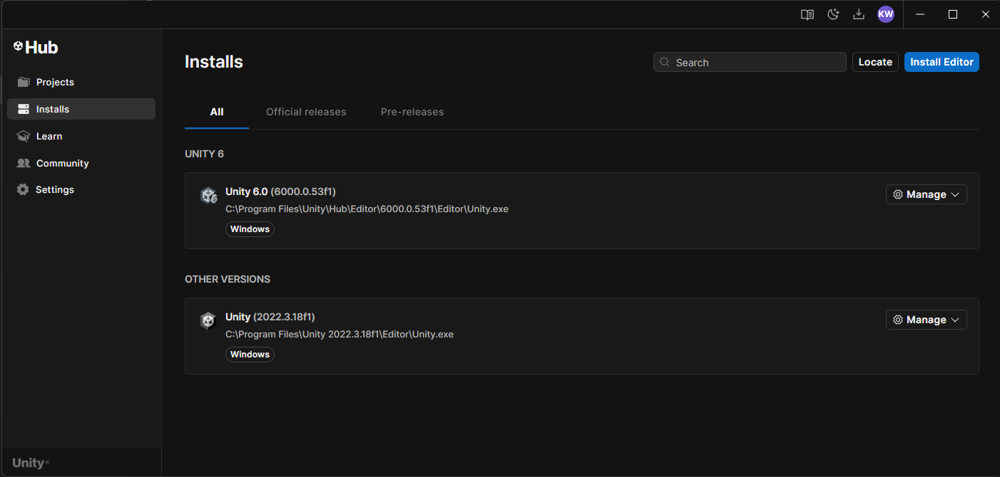
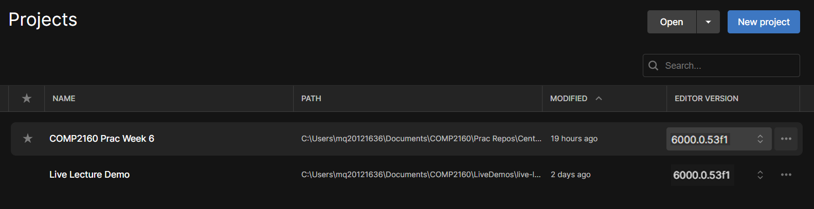

# Prac 0: Getting started as a Game Developer

Hello! Welcome to Prac 0 for COMP2160 Game Development. This practical is designed to get you acquainted with a few of the features and tools you will be expected (or may want to!) use throughout this semester. Feel free to revisit this practical worksheet whenever you are stuck or just need a bit of a refresher.

## Using Version Control
An important part of game development (and really any software dev) is proper version control. There are many version control solutions out there, but at Macquarie University we focus on teaching you git. We also use Github and it's client, Github Desktop, throughout all our examples. You will have been exposed to all three (git, Github and Github Desktop) in COMP1150/COMP1151, but you might want to brush up.

### ...Did you just say "git" like three times?
git is a distributed version control system (VCS). This is the actual system which tracks changes to files, allowing you to manage and track versions of your projects. We refer to these projects as "repositories". Github, on the other hand, is an organisation that provides hosting services for git repositories, like the one you are checking out right now. They are one of many vendors, with the other two most popular being Bitbucket and Gitlab.

Finally, Github Desktop is a GUI and client for interfacing with git repositories. It allows you to push, pull, branch, etc. in a relatively painless way. Again, there are many alternatives, including GitKraken, Sourcetree and simply interfacing with your repository directly via command line. Github Desktop has been chosen as it is pretty easy to use, but the trade-off is it has less functionality than some of ther clients. You are free to use whatever you want in this unit, but we officially support Github Desktop.

If you are working on your own device, you may wish to check out [GitKraken](https://www.gitkraken.com/) or [Git Extensions](https://alternativeto.net/software/gitextensions/about/).

### Making changes
To make changes to a repo, you will first need to clone it to your computer. Go ahead and clone this repo to your computer by pressing the "Code" button in the top right corner, then "Open with Github Desktop". 


Make sure you change the local path to the local drive, don't clone to the H drive/Claudius! This drive can't handle large projects like Unity projects, and you'll run into problems if you try to work off this drive.


Once you've cloned this repo, navigate to it on your computer. You should find inside this file as "Readme.md". Open it up in a text editor of your choice and try writing your name below this line.

-------------------------
YOUR NAME GOES HERE!
-------------------------

Nice work! Now, save your file and head back to Github Desktop. Enter a meaningful commit message, press "Commit" and then "Push" your changes.

### I'm still stuck
That's okay! This is just a quick refresher as we covered a lot of this last in COMP1150/COMP1151. However, we've included an additional Readme file here from Github that goes into more detail about how Github operates. You can check it out [here](resources/gitrefresher.md).

## Using Unity
Unity is the game engine of choice in this unit. While not without its faults, Unity provides students a good overview of many different aspects of game development, and is also relatively accessible while not abstracting away too much programming. It also uses C# rather than a bespoke langauge, meaning that learning Unity will give you transferable skills in game development. Other game engines on the market include Unreal Engine, Godot and Pico-8.

This document will not go over how to use Unity - the Week 1 practical task will help you re-familirise yourself with its use. Instead, we will be focusing on making sure you have Unity up and running. As stated, please feel free to return to this document whenever you find yourself stuck working on a new device and aren't sure how to get things moving.

### Installing Unity
If you are working on your own device, you'll need to first install Unity. If you are working on one of our lab computers, you will under no circumstances need to download or install a version of Unity.

If you are on your own device, head to unity.com and follow the instructions to create an account and download Unity, selecting the appropriate version.

Unity now manages itself via Unity Hub, which allows you to have multiple version of Unity installed at once. See the next steps on how to locate an already installed version.

### Locating an Install
If you only have one version of Unity on your computer, it will likely already be linked up. However, if it hasn't, or you have multiple versions of Unity installed (which will be true if you are working on the lab computers!) you will need to Locate the right version of Unity.

To do so, press the "Installs" button on the left side of Unity Hub, then press "Locate". This will open up File Explorer. 



On your own device, you will need to navigate to wherever you have installed your version of Unity. On the lab PCs, this will be:

```
C:/ > Program Files > Unity > Hub > Editor > 2022.3.37f1 > Editor
```

You then want to find the application named "Unity". Click on it once and then press "Select Editor". You should now see this version of Unity appear in your list of Installs in Unity Hub.

To set the editor version of a Unity project, head back to the "Projects" panel and click on the corresponding "Editor Version" cell, selecting the version you want to switch to. Please note that all practicals for this unit are set to 2022.3.37f1, and this is the version you should make sure you are running for each project.



## Writing code
In this unit, we write a lot of code! So, it is important you have a programming environment set-up that you are happy with. These last few steps will give you some tips on getting started as a game programmer.

### Picking an IDE
As with version control clients, we aren't actually too restrictive on what you want to write your code in for this unit. We predominently use VS Code, as it provides good Unity integration while still being light-weight enough to work with. However, you are free to use something more stripped-back such as Sunset Code (on Mac) or something with a bit more firepower, such as Visual Studio.

### Installing plug-ins (for VSCode)
Most IDEs allow you to install plug-ins/extensions that make certain parts of your workload easier. There is no shame in doing so, and using plug-ins isn't "cheating" (although you'll occasionally encounter someone who will tell you it is! Ignore them). You will be familiar with using various Java extensions in COMP1010. It can be a bit overwhelming seeing how many different extensions are out there, and some can be a bit dodgy. To get started in VSCode, click the "Extensions" button to the left (or press Ctrl+Shift+X on PC) and type "Unity" into the search bar. The first extension, simply callled "Unity" and Published by Microsoft, is a good one to add some debugging and API referencing into your project. It can take a bit to get working, and things are likely to update - rather than duplicating information and confusing you if things change, we recommend you read through the extension description on how to get things moving in Unity.


If you require a bit more grunt and a more seamless workflow with the use of extensions such as Intellisense, we recommend using Visual Studio. However, we will be sticking to VS Code and referencing documentation in live lectures, because we believe this is a worthwhile habit to develop as a programmer.

### Intellisense, Intellicode, Co-Pilot and...What else?
Like we said, installing different extensions can be confusing, and it isn't always clear cut what is what. As you embark on your own learning journey, you likely have your own beliefs and understandings about what you want to try and learn for yourself, and what you want to use different tools to help you with (such as Generative AI). No one is going to congratulate you for working at a disadvantage (such as shirking using an IDE at all and just writing all your code in notepad), but it's also important to make sure you aren't automating a process it would be best for you to learn. Here's a bit of info to help you make the right decision for yourself. It is also important to create a distinction between these different types of plug-ins, as nuance can indeed get lost in casual conversation (or occasionally lectures!).

**Intellisense:** Intellisense is a broad term used by Microsoft to refer to a suite of tools that can provide auto-completion, corrections and drop-down references while you are programming. In essence, Intellisense isn't just one single tool, but a number of different tools. When a classmate advised you to "install Intellisense", they are likely referring to one of these particular extensions that bare the IntelliSense banner. You can find out more here: https://code.visualstudio.com/docs/editor/intellisense. Arguably, you could consider the Unity extension a version of Intellisense. More recently, however, the term "Intellisense" has been used by Microsoft to also encompass the use of Github Co-Pilot inside your IDE. This is a little controversial, as many folk rightfully feel there is a distinction between the spirit of Intellisense (helping you along the way and stopping you from having to always check syntax) and generating code directly for you. When you hear someone refer to Intellisense as being Generative AI, this newer distinction by Microsoft is what they are referencing.

**Intellicode:** On the other hand, Intellicode is a straight-up Generative AI plug-in that will complete code for you. Again, Microsoft is a bit liberal here, and has at times referred to Intellicode as a form of Intellisense. As far as we are aware, Intellicode does not yet have C# capabilities, but can be used for Python and Java programming.

Again, where you draw the line is up to you. We welcome you coming and chatting to us for advise on this. In general, we believe that the use of extensions and plug-ins that allow you to learn better are great, but those that make it so you don't have to learn (like writing your code for you) are only going to hurt you in the long run. Make the decision that best suits you, your learning journey and the kind of legacy you want to leave as a game developer.

## Documentation
Regardless, you should be checking Unity documentation regularly. Throughout this unit, most of the programming challenges you'll face can be solved via the use of the Unity documentation. As a warm-up activity, start at the Unity documentation home page: https://docs.unity3d.com/ScriptReference/ And see if you can find the method that lets you set the parent of a gameObject in Unity.

<details>
  <summary>Psst! Click here for the answer!</summary>
  SetParent(), which is a public method on the Transform class, taking another transform and a bool as its parameters. You can find out more here: [https://docs.unity3d.com/ScriptReference/Transform.SetParent.html](https://docs.unity3d.com/ScriptReference/Transform.SetParent.html).
</details>

Getting familiar with navigating and researching using the Unity docs is going to be a great skill for you to develop, whether you intend to stick with Unity or not.

## That's it!
We hope you've enjoyed this prac and that it has given you a good overview of your working environment as a game developer. I now encourage you to edit your Github profile's about section to include a short summary about yourself and your goals as a game developer. For many of you, this is the start of your journey into the games industry, and we can't wait to see what you come up with!
